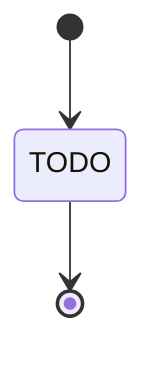
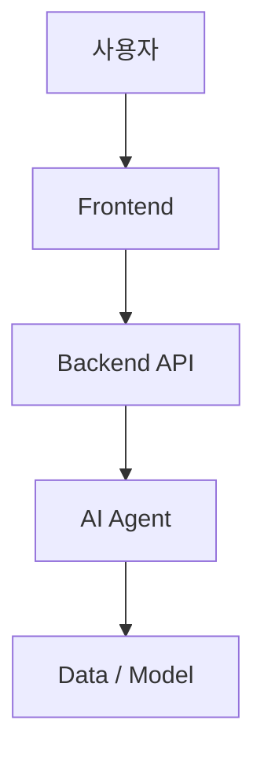

# AI Agent 프로젝트 소스 분석 보고서

> 이 문서는 첨부된 `3.최종 리포트_반세윤.docx`의 필수 순서와 항목을 유지한 소스 분석용 템플릿이다.  
> 모든 내용은 실제 Repository의 소스코드, 설정, 테스트, 실행 산출물을 근거로 작성한다.  
> 확인되지 않은 내용은 추측하지 말고 `확인 불가`, 구현되지 않은 기능은 `미구현`, 수행하지 않은 작업은 `미진행`, 적용 대상이 아니면 `해당 없음`으로 표시한다.

## 작성 원칙

- 실제 파일명, 경로, 패키지, 모듈, 클래스, 함수, 메서드, 환경변수, API Endpoint 및 모델명을 그대로 사용한다.
- 주요 설명에는 가능한 한 `근거: 파일 경로 / Symbol`을 함께 기록한다.
- 단순 의존성 목록이 아니라 각 기술의 역할, 호출 관계, 데이터 흐름과 적용 위치를 설명한다.
- 실행 또는 외부 시스템 확인이 필요한 내용은 소스에서 검증 가능한 범위와 실제 실행 확인 범위를 구분한다.
- 비밀값, 토큰, 비밀번호, 개인정보는 보고서에 기록하지 않는다.
- 본문 작성 완료 후 Repository와 다시 대조하여 존재하지 않는 명칭이나 추측이 포함되지 않았는지 검증한다.

---

# 1. 프로젝트 제목

<!-- README, 패키지 메타데이터, 서비스명, 화면 제목 등을 근거로 프로젝트 목적과 기능이 드러나는 제목을 작성한다. -->

**프로젝트 제목:** `[소스 분석 결과를 작성]`

**근거:** `[파일 경로 / 설정 키 / 화면 또는 모듈명]`

---

# 2. 프로젝트 주제 / 목적 / 목표

## 2-1. 프로젝트 주제

<!-- 어떤 문제를 해결하는 AI Agent인지, 주요 사용자와 처리 범위를 실제 구현 기준으로 설명한다. -->

`[소스 분석 결과를 작성]`

**근거:** `[파일 경로 / Class / Function]`

## 2-2. 프로젝트 목적

<!-- README, 요구사항 문서, UI 문구와 실제 기능을 종합하여 작성한다. -->

- `[목적 1]`
- `[목적 2]`
- `[목적 3]`

**근거:** `[파일 경로 / 관련 Symbol]`

## 2-3. 프로젝트 목표

<!-- 구현된 기술적 목표를 작성한다. 계획만 있고 구현되지 않은 것은 미구현으로 구분한다. -->

| 번호 | 기술적 목표 | 구현 상태 | 소스 근거 |
|---:|---|---|---|
| 1 | `[목표]` | `[구현 / 부분 구현 / 미구현]` | `[경로 / Symbol]` |
| 2 | `[목표]` | `[구현 / 부분 구현 / 미구현]` | `[경로 / Symbol]` |

---

# 3. 주요 구현 기술 및 10개 질문과 답

## Q1. 프로젝트에서 사용한 LLM은 무엇인가?

- **모델명:** `[정확한 모델명]`
- **실행 환경 및 호출 방식:** `[Ollama / API / Cloud / Local 등]`
- **적용 기능:** `[질문 분석, 라우팅, 답변 생성, Query 생성 등]`
- **선택 이유:** `[소스 또는 문서에서 확인되는 경우만 작성]`
- **주요 설정:** `[Base URL, temperature, timeout 등 — 비밀값 제외]`
- **근거:** `[파일 경로 / Class / Function / 환경변수명]`

## Q2. 프로젝트에서 사용한 Embedding Model과 Vector DB는 무엇인가?

- **Embedding Model:** `[모델명]`
- **Vector DB:** `[제품/라이브러리명]`
- **저장 데이터:** `[문서 종류와 저장 단위]`
- **Chunking 방식:** `[Splitter, chunk_size, overlap 등]`
- **Collection / Index:** `[실제 명칭]`
- **검색 방식:** `[Similarity / MMR / Hybrid 등]`
- **근거:** `[파일 경로 / Class / Function / 설정명]`

## Q3. 프로젝트에서 적용한 Advanced RAG 기법은 무엇인가?

<!-- 실제 적용된 기법만 남기며, 최소 개수 조건을 맞추기 위해 존재하지 않는 기법을 추가하지 않는다. -->

| Advanced RAG | 적용 내용 | 처리 위치 | 소스 근거 |
|---|---|---|---|
| `[기법명]` | `[프로젝트에서의 역할과 처리 흐름]` | `[Node / 함수 / 단계]` | `[경로 / Symbol]` |
| `[기법명]` | `[프로젝트에서의 역할과 처리 흐름]` | `[Node / 함수 / 단계]` | `[경로 / Symbol]` |

## Q4. RAG 데이터는 어떤 자료를 사용했는가?

| 데이터 형식/출처 | 내용 | 파일 또는 레코드 수 | 수집·적재 방식 | 소스 근거 |
|---|---|---:|---|---|
| `[PDF / TXT / CSV / Web / 기타]` | `[데이터 설명]` | `[수량 또는 확인 불가]` | `[Loader / Collector / Pipeline]` | `[경로 / Symbol]` |

**데이터 전처리 및 메타데이터:** `[정제, 분할, category, source, page 등]`

## Q5. Multi-Agent를 사용했는가? 사용했다면 Agent별 역할은 무엇인가?

**사용 여부:** `[사용 / 미구현 / 해당 없음]`

| Agent | 역할 | 입력/출력 | 이동 또는 호출 조건 | 소스 근거 |
|---|---|---|---|---|
| `[Agent명]` | `[역할]` | `[State 또는 데이터]` | `[Conditional Edge / 직접 호출 등]` | `[경로 / Symbol]` |

**Agent 간 제어 방식:** `[LangGraph Conditional Edge, Supervisor, Router 등의 실제 구조]`

## Q6. Tool Calling을 사용했는가? 어떤 Tool을 구현했는가?

**사용 여부:** `[사용 / 미구현 / 해당 없음]`

| Tool | 기능 | 입력 | 출력 | 호출 주체/조건 | 소스 근거 |
|---|---|---|---|---|---|
| `[Tool명]` | `[기능]` | `[입력 Schema]` | `[출력]` | `[Agent / LLM / 조건]` | `[경로 / Symbol]` |

## Q7. LangGraph는 어떤 구조로 설계했는가?

### 주요 Node와 Edge

<!-- 위 다이어그램을 실제 Node, Edge, Conditional Edge 및 END 흐름으로 교체한다. -->

| 구분 | 실제 명칭 | 역할 또는 전이 조건 | 소스 근거 |
|---|---|---|---|
| Node | `[Node명]` | `[처리 역할]` | `[경로 / 함수]` |
| Edge | `[From → To]` | `[전이 조건]` | `[경로 / 라우팅 함수]` |

### State 정보

| State 필드 | 타입 | 생성/변경 Node | 사용 목적 | 소스 근거 |
|---|---|---|---|---|
| `[필드명]` | `[타입]` | `[Node명]` | `[목적]` | `[경로 / State 정의]` |

## Q8. 프로젝트에 추가로 구현한 기능은 무엇인가?

| 추가 기능 | 구현 내용 | 연계 Component | 구현 상태 | 소스 근거 |
|---|---|---|---|---|
| `[기능명]` | `[동작 설명]` | `[DB / API / UI / 외부 서비스 등]` | `[구현 / 부분 구현]` | `[경로 / Symbol]` |

## Q9. Backend / Frontend / SSE는 어떻게 구현했는가?

### Backend

- **Framework 및 실행 방식:** `[FastAPI, Uvicorn 등]`
- **Application 진입점:** `[파일 / app 객체 / 실행 명령]`
- **주요 Middleware·예외처리·CORS:** `[분석 결과]`
- **근거:** `[파일 경로 / Symbol]`

### Endpoint

| Method | Endpoint | 기능 | Request | Response | 구현 위치 |
|---|---|---|---|---|---|
| `[GET/POST/...]` | `[/path]` | `[기능]` | `[Schema]` | `[Schema / Media Type]` | `[경로 / 함수]` |

### Frontend

- **Framework:** `[Streamlit / Vue / React 등]`
- **주요 화면과 기능:** `[Chat UI, Upload, 출처 표시 등]`
- **Backend 연동:** `[URL 설정, REST/SSE 호출 함수]`
- **근거:** `[파일 경로 / Function / 환경변수명]`

### SSE Streaming

- **구현 여부:** `[구현 / 미구현]`
- **Endpoint 및 Media Type:** `[경로 / text/event-stream 등]`
- **Event 형식과 종료 처리:** `[data, event, done/error 등]`
- **Frontend 소비 방식:** `[requests, EventSource, stream parser 등]`
- **근거:** `[Backend와 Frontend 양쪽 파일 경로 / Symbol]`

## Q10. RAGAS 평가 결과는 어떠했는가?

| 평가 Metric | 결과 | 결과 파일/실행 근거 | 해석 |
|---|---:|---|---|
| `[Faithfulness 등]` | `[점수 또는 미진행]` | `[CSV / JSON / 로그 경로]` | `[결과 해석]` |

- **평가 Dataset:** `[질문 수, 생성 방식, 주요 Column]`
- **평가 모델 및 설정:** `[확인된 내용]`
- **종합 해석:** `[강점, 한계, 개선 필요 항목]`
- **소스 근거:** `[평가 Script / Function / 설정 경로]`

---

# 4. 전체 시스템 설계 다이어그램

<!-- Repository의 실제 Component와 데이터 흐름을 한 장에 표현한다. 구현되지 않은 예시 Component는 넣지 않는다. -->

## 주요 Component

| Component | 역할 | 주요 기술 | 연결 대상 | 소스 근거 |
|---|---|---|---|---|
| `[Component명]` | `[역할]` | `[기술]` | `[연결 대상/Protocol]` | `[경로 / 설정]` |

**주요 기술 Stack:** `[실제 Dependency 및 설정을 근거로 작성]`

**전체 데이터 흐름:** `[사용자 요청부터 최종 응답까지 호출·데이터 흐름을 순서대로 설명]`

---

# 5. 프로젝트 실행 결과 화면

> 소스코드 화면이 아니라 실제 실행 결과를 중심으로 기록한다. 실행하지 않았거나 캡처가 없으면 `미진행` 또는 `확인 불가`로 표시한다. 자동 분석 환경에서 캡처할 수 없다면, 필요한 실행 명령과 기대 확인 지점을 소스 근거로 작성하되 성공했다고 단정하지 않는다.

## 5-1. Vector DB 생성 결과

- **상태:** `[확인 / 미진행 / 확인 불가]`
- **실행 명령:** `[명령]`
- **문서 및 Chunk 수:** `[결과]`
- **Embedding / Collection:** `[결과]`
- **결과 화면:** `[이미지 삽입 또는 캡처 파일 경로]`
- **근거:** `[Builder Script / 로그 / DB 경로]`

## 5-2. RAGAS 평가 결과

- **상태:** `[확인 / 미진행 / 확인 불가]`
- **실행 명령:** `[명령]`
- **평가 결과 요약:** `[Metric 및 점수]`
- **생성 파일:** `[CSV / JSON 등]`
- **결과 화면:** `[이미지 삽입 또는 캡처 파일 경로]`

## 5-3. Backend 실행 화면

- **상태:** `[확인 / 미진행 / 확인 불가]`
- **실행 명령 및 Port:** `[명령 / Port]`
- **Swagger URL:** `[URL 또는 해당 없음]`
- **Health Check:** `[Endpoint / 결과]`
- **결과 화면:** `[이미지 삽입 또는 캡처 파일 경로]`

## 5-4. REST API 실행 결과

- **상태:** `[확인 / 미진행 / 확인 불가]`
- **호출 Endpoint:** `[Method / Path]`
- **요청 예시:** `[민감정보를 제외한 실제 Schema]`
- **응답 예시:** `[실행 결과 또는 확인 불가]`
- **결과 화면:** `[Swagger / Postman / curl 캡처]`

## 5-5. SSE Streaming 실행 결과

- **상태:** `[확인 / 미진행 / 확인 불가]`
- **호출 Endpoint:** `[Method / Path]`
- **Streaming 확인 내용:** `[Event 순서, Chunk 출력, 종료 Event]`
- **결과 화면:** `[Frontend 또는 Terminal 캡처]`

## 5-6. Frontend 실행 화면

- **상태:** `[확인 / 미진행 / 확인 불가]`
- **실행 명령 및 접속 URL:** `[명령 / URL]`
- **확인 기능:** `[질문/답변, 출처, Streaming 등]`
- **결과 화면:** `[이미지 삽입 또는 캡처 파일 경로]`

## 5-7. Multi-Agent / Tool Calling 결과

- **상태:** `[확인 / 미진행 / 해당 없음]`
- **검증 Scenario:** `[User Query → Router/Supervisor → Agent → Tool → Answer]`
- **실행 로그 요약:** `[실제 Route, Agent, Tool명]`
- **결과 화면:** `[이미지 삽입 또는 캡처 파일 경로]`

## 5-8. 추가 기능 실행 결과

| 기능 | 실행 상태 | 확인 내용 | 결과 화면/산출물 | 근거 |
|---|---|---|---|---|
| `[기능명]` | `[확인 / 미진행]` | `[결과]` | `[경로]` | `[관련 소스]` |

---

# 6. CI/CD 및 서버 배포 결과

> CI/CD 또는 배포를 진행하지 않았다면 이 절의 상태를 `CI/CD 미진행`으로 표시하고, 존재하지 않는 실행 결과를 작성하지 않는다.

**전체 상태:** `[완료 / 부분 완료 / CI/CD 미진행 / 확인 불가]`

## 6-1. GitHub Repository

- **Repository URL:** `[URL 또는 확인 불가]`
- **기본 Branch:** `[Branch]`
- **근거:** `[git remote 또는 문서/설정]`

## 6-2. Git Commit / Push

- **최종 Commit:** `[SHA / Message 또는 확인 불가]`
- **Push 상태:** `[확인 / 확인 불가]`
- **결과 화면:** `[캡처 경로 또는 미진행]`

## 6-3. GitHub Actions 실행 화면

| Workflow | Trigger | 주요 Job/Step | 최근 결과 | 설정 파일 |
|---|---|---|---|---|
| `[Workflow명]` | `[push / workflow_dispatch 등]` | `[Test / Build / Deploy 등]` | `[성공 / 실패 / 확인 불가]` | `[.github/workflows/...]` |

**실행 화면:** `[이미지 삽입 또는 확인 불가]`

## 6-4. 실제 서버 실행 확인

- **배포 방식:** `[Docker Compose / Kubernetes / 직접 실행 등]`
- **서비스/컨테이너:** `[이름, 상태, Port]`
- **확인 명령:** `[docker compose ps / kubectl get ... 등]`
- **실행 결과:** `[실제 결과 또는 확인 불가]`
- **근거:** `[Dockerfile / Compose / Manifest / 배포 Script]`

## 6-5. 최종 서비스 접속 화면

- **서비스 URL:** `[URL 또는 확인 불가]`
- **접속 상태:** `[정상 / 실패 / 미확인]`
- **검증 일시:** `[YYYY-MM-DD HH:mm TZ 또는 미확인]`
- **검증 내용:** `[화면 접속, 질문/답변, Health Check 등]`
- **결과 화면:** `[이미지 삽입 또는 캡처 파일 경로]`

---

# 최종 검증 체크리스트

- [ ] 원본 DOCX의 1~6번 필수 항목과 하위 항목 순서를 유지했다.
- [ ] 존재하지 않는 파일, Class, Function, Method, Agent 또는 Tool을 작성하지 않았다.
- [ ] API Endpoint와 HTTP Method를 Router 정의 및 Swagger/OpenAPI와 대조했다.
- [ ] LLM, Embedding, Vector DB 및 기술 Stack을 Dependency와 설정 파일에서 확인했다.
- [ ] LangGraph Node, Edge, State 및 분기 조건을 실제 Graph 구성 코드와 대조했다.
- [ ] RAG 데이터 수량과 Chunk 수는 실제 파일 또는 실행 결과로 확인했다.
- [ ] RAGAS 점수는 실제 결과 파일이나 로그가 있을 때만 작성했다.
- [ ] Docker, CI/CD 및 배포 결과는 설정 존재 여부와 실제 실행 성공 여부를 구분했다.
- [ ] 모든 주요 분석 내용에 파일 경로 또는 Symbol 근거를 기록했다.
- [ ] Secret, Token, Password 및 개인정보가 포함되지 않았는지 확인했다.
- [ ] 미확인·미구현·미진행·해당 없음 항목을 명확히 표시했다.

