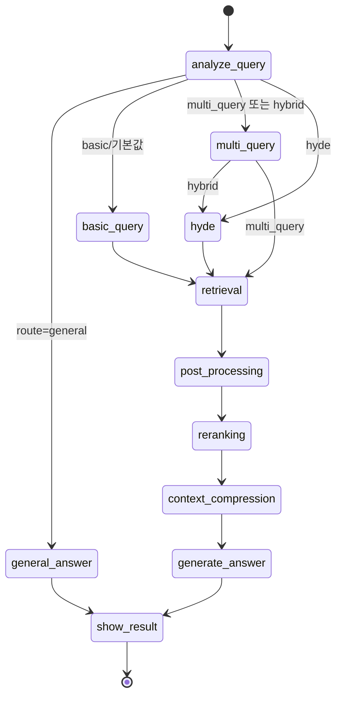
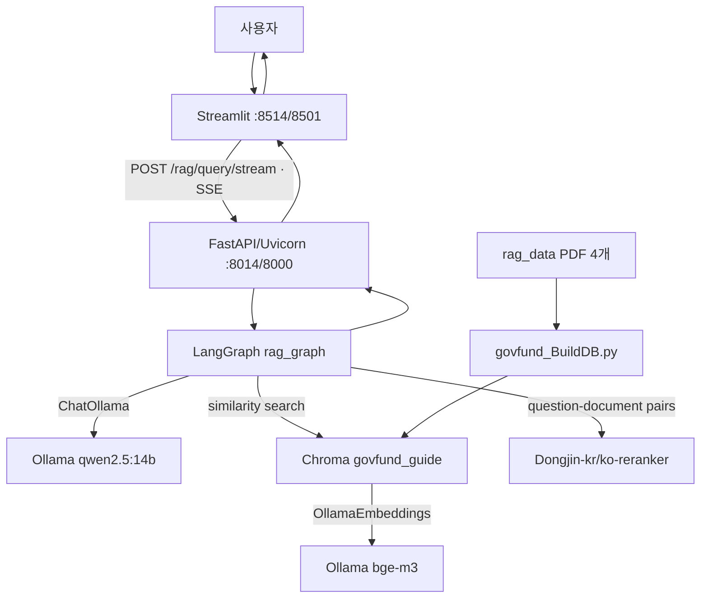

# AI Agent 프로젝트 소스 분석 보고서

> 이 문서는 `docs/report-template.md`의 장·절·표 구조를 유지하여 현재 Repository의 실제 소스, 설정, 실행 산출물을 분석한 결과이다. 확인되지 않은 실행 성공이나 점수는 추측하지 않았다.

## 작성 원칙

- 실제 파일명, 경로, 모듈, 클래스, 함수, 환경변수, API Endpoint 및 모델명을 사용했다.
- 소스에서 확인되는 구현과 저장소에 남은 실행 캡처, 현재 환경에서 재검증한 결과를 구분했다.
- 비밀값, 토큰, 비밀번호 및 개인정보는 기록하지 않았다.

---

# 1. 프로젝트 제목

**프로젝트 제목:** 정부 지원사업 상담 Agent

**근거:** `README.md` 제목 / `src/streamlit_app.py`의 `st.title` / `src/main.py`의 `FastAPI(title="Advanced RAG API")`

---

# 2. 프로젝트 주제 / 목적 / 목표

## 2-1. 프로젝트 주제

정부 지원사업 공고 PDF를 Chroma Vector DB에 적재하고, 사용자의 자연어 질문을 LangGraph 기반 Advanced RAG 파이프라인으로 분석·검색·재정렬·압축하여 근거가 포함된 상담 답변을 제공하는 웹 서비스이다. 사용자는 Streamlit 화면에서 질문하고 FastAPI의 SSE 진행 이벤트와 최종 결과를 받는다.

**근거:** `src/govfund_BuildDB.py` / `load_documents`, `split_documents`, `build_vector_db`; `src/govfund_agent.py` / `build_graph`; `src/main.py` / `query_rag_stream`; `src/streamlit_app.py`

## 2-2. 프로젝트 목적

- 정부 지원사업 관련 질문에 공고문 근거를 검색하여 상담 답변을 생성한다.
- Multi-Query, HyDE, 후처리, Cross-Encoder Reranking, Context Compression을 조합해 검색 품질을 높인다.
- REST/SSE API와 Streamlit UI로 처리 진행 상황, 답변, 출처 및 실행 지표를 제공한다.

**근거:** `docs/기능요구사항.md` / GF-001, GF-004, GF-010~GF-018, GF-022~GF-024; `src/govfund_agent.py` / 각 Graph Node; `src/main.py`; `src/streamlit_app.py`

## 2-3. 프로젝트 목표

| 번호 | 기술적 목표 | 구현 상태 | 소스 근거 |
|---:|---|---|---|
| 1 | PDF 공고문 Chunking·Embedding·Chroma 적재 | 부분 구현 | `src/govfund_BuildDB.py`; PDF 4개와 `chroma_govfund_db/`가 존재하나 `load_documents`가 PDF를 텍스트 모드로 여는 오류 가능성이 있고 생성 로그는 없음 |
| 2 | LangGraph 기반 질문 분석 및 검색 전략 라우팅 | 구현 | `src/govfund_agent.py` / `AdvancedRAGState`, `analyze_query_node`, `route_after_analyze`, `build_graph` |
| 3 | Multi-Query·HyDE·후처리·Reranking·Context Compression | 구현 | `src/govfund_agent.py` / `multi_query_node`, `hyde_node`, `post_processing_node`, `reranking_node`, `context_compression_node` |
| 4 | FastAPI REST 및 SSE API | 구현 | `src/main.py` / `query_rag`, `query_rag_stream`, `event_generator` |
| 5 | Streamlit 상담 UI와 SSE 소비 | 구현 | `src/streamlit_app.py` / `iter_sse_events` 및 화면 구성 |
| 6 | RAGAS 품질 평가 | 부분 구현 | `src/evaluate_ragas_local.py`; 4개 Metric 로직은 있으나 모듈 import 불일치와 길이 assertion 때문에 현재 실행 불가 |
| 7 | Docker Compose 및 GitHub Actions 배포 자동화 | 구현(설정), 실행 결과 일부 확인 | `Dockerfile.backend`, `Dockerfile.frontend`, `docker-compose.yml`, `.github/workflows/deploy.yml`, `docs/배포_CICD_0827.png` |
| 8 | 기업정보 관리, 외부 사이트 Tool Calling, 상담 이력 DB | 미구현 | 요구사항은 `docs/기능요구사항.md` GF-002, GF-013, GF-019, GF-025에 있으나 관련 소스 없음 |

---

# 3. 주요 구현 기술 및 10개 질문과 답

## Q1. 프로젝트에서 사용한 LLM은 무엇인가?

- **모델명:** `qwen2.5:14b`
- **실행 환경 및 호출 방식:** Ollama 서버를 `langchain_ollama.ChatOllama`로 호출하는 방식이다.
- **적용 기능:** 질문 라우팅/전략 분석, Multi-Query 생성, HyDE 가상 문서 생성, 일반 질문 답변, Context Compression, 최종 답변 생성, RAGAS 채점에 사용한다.
- **선택 이유:** 소스 또는 문서에서 명시적인 선택 이유는 확인 불가이다.
- **주요 설정:** Agent는 `temperature=0`, `base_url=http://10.8.0.1:11434`; RAGAS 평가기는 `temperature=0`이며 별도 Base URL을 지정하지 않는다. 인증 환경변수는 없다.
- **근거:** `src/govfund_agent.py` / `OLLAMA_MODEL`, `llm`, 각 Prompt Node; `src/evaluate_ragas_local.py` / `EVAL_LLM_MODEL`, `ChatOllama`

## Q2. 프로젝트에서 사용한 Embedding Model과 Vector DB는 무엇인가?

- **Embedding Model:** `bge-m3` (Ollama)
- **Vector DB:** Chroma (`langchain_chroma.Chroma`; fallback으로 `langchain_community.vectorstores.Chroma`)
- **저장 데이터:** `rag_data`의 PDF 페이지를 `Document`로 로드한 뒤 분할한 Chunk와 `source`, `page`, `category`, `chunk_index` 메타데이터
- **Chunking 방식:** `RecursiveCharacterTextSplitter`, `chunk_size=400`, `chunk_overlap=50`
- **Collection / Index:** `govfund_guide`; 영속 경로 `../chroma_govfund_db`
- **검색 방식:** 각 검색 Query마다 `similarity_search_with_relevance_scores(k=3)`를 수행하는 벡터 유사도 검색. 이름상 Hybrid 전략은 Multi-Query와 HyDE를 연속 적용하는 Query 확장이며 sparse/BM25 결합 검색은 아니다.
- **근거:** `src/govfund_BuildDB.py` / 상수, `split_documents`, `build_vector_db`; `src/govfund_agent.py` / `vectorstore`, `retrieval_node`

## Q3. 프로젝트에서 적용한 Advanced RAG 기법은 무엇인가?

| Advanced RAG | 적용 내용 | 처리 위치 | 소스 근거 |
|---|---|---|---|
| Query Routing | LLM이 `rag/general`과 `basic/multi_query/hyde/hybrid/none`을 JSON으로 판단해 Graph 분기를 선택 | `analyze_query_node`, conditional edge | `src/govfund_agent.py` / `analyze_query_node`, `route_after_analyze` |
| Multi-Query | 원 질문을 의미가 같은 3개 검색 질문으로 확장하고 원 질문과 합친다 | `multi_query` Node | `src/govfund_agent.py` / `multi_query_node` |
| HyDE | 질문에 대한 2~3문장의 가상 상담 문서를 만들어 검색 Query에 추가한다 | `hyde` Node | `src/govfund_agent.py` / `hyde_node` |
| Hybrid Query Expansion | `hybrid` 선택 시 Multi-Query 다음 HyDE를 수행한다. 벡터+sparse Hybrid Search는 미구현이다 | `multi_query → hyde` conditional edge | `src/govfund_agent.py` / `route_after_multi_query`, `build_graph` |
| Retrieval Post-Processing | 내용 중복 제거, relevance score 0.5 필터, category 필터, 상위 8개 제한을 순차 적용한다 | `post_processing` Node | `src/govfund_agent.py` / `post_processing_node` |
| Cross-Encoder Reranking | `Dongjin-kr/ko-reranker`가 질문-문서 쌍을 재채점해 상위 5개를 선택한다 | `reranking` Node | `src/govfund_agent.py` / `reranking_node` |
| Context Compression | Reranking 문서에서 답변에 필요한 문장만 LLM으로 추출한다 | `context_compression` Node | `src/govfund_agent.py` / `context_compression_node` |

## Q4. RAG 데이터는 어떤 자료를 사용했는가?

| 데이터 형식/출처 | 내용 | 파일 또는 레코드 수 | 수집·적재 방식 | 소스 근거 |
|---|---|---:|---|---|
| PDF / 중앙부처·지자체 창업지원사업 통합공고 | 2026년도 창업지원사업 | 1파일 | `PyPDFLoader` → Chunk → Ollama Embedding → Chroma | `rag_data/(공고문)_2026년도_중앙부처_및_지자체_창업지원사업_통합공고문(제2025-648호,_2025.12.19.).pdf`; `src/govfund_BuildDB.py` |
| PDF / 중소벤처기업부 | 2026년 소상공인 지원사업 통합 공고 | 1파일 | 동일 | `rag_data/2026년_중소벤처기업부_소상공인_지원사업_통합_공고.pdf` |
| PDF / 스마트제조혁신 지원사업 | 2026년 통합공고(수정) | 1파일 | 동일 | `rag_data/251031 (제2025-574호) 26년 스마트제조혁신 지원사업 통합공고(수정).pdf` |
| PDF / 정부·지자체 보도자료 | 2026년 창업지원 예산 관련 자료 | 1파일 | 동일 | `rag_data/251219_정부·지자체__2026년_창업지원에_3조_4_645억원_투입(창업정책과).pdf` |
| TXT | 짧은 소스 메모 | 1파일 | Builder가 `*.pdf`만 선택하므로 적재되지 않음 | `rag_data/소스.txt`; `src/govfund_BuildDB.py` / `glob(..., "*.pdf")` |

**데이터 전처리 및 메타데이터:** PDF 페이지별 `Document`의 기존 `source`, `page` 메타데이터에 `category`를 추가한다. 지정된 통합공고 한 파일만 `notice`, 나머지는 `general`이며 분할 후 전체 순번 `chunk_index`를 추가한다. 정확한 페이지/Chunk 수는 생성 로그가 없어 확인 불가이다. `chroma_govfund_db/chroma.sqlite3` 및 HNSW 파일은 존재한다.

## Q5. Multi-Agent를 사용했는가? 사용했다면 Agent별 역할은 무엇인가?

**사용 여부:** 미구현. 하나의 `StateGraph` 안에서 기능별 Node를 연결한 단일 RAG Workflow이며, 독립 Agent·Supervisor·Agent 간 메시지 교환 구조는 없다.

| Agent | 역할 | 입력/출력 | 이동 또는 호출 조건 | 소스 근거 |
|---|---|---|---|---|
| 해당 없음 | 독립 Agent 정의 없음 | 해당 없음 | 해당 없음 | Repository 전체 Python 소스; `src/govfund_agent.py`에는 하나의 `StateGraph`만 존재 |

**Agent 간 제어 방식:** 해당 없음. 제어는 `route_after_analyze`, `route_after_multi_query`를 사용한 LangGraph Conditional Edge이다.

## Q6. Tool Calling을 사용했는가? 어떤 Tool을 구현했는가?

**사용 여부:** 미구현. LLM에 Tool schema를 bind하거나 `@tool`, `ToolNode`를 정의한 소스가 없다. Vector DB 검색은 Graph Node가 직접 호출한다.

| Tool | 기능 | 입력 | 출력 | 호출 주체/조건 | 소스 근거 |
|---|---|---|---|---|---|
| 해당 없음 | Tool Calling 미구현 | 해당 없음 | 해당 없음 | 해당 없음 | `src/govfund_agent.py`; `docs/기능요구사항.md` / GF-013은 요구사항만 존재 |

## Q7. LangGraph는 어떤 구조로 설계했는가?

### 주요 Node와 Edge

| 구분 | 실제 명칭 | 역할 또는 전이 조건 | 소스 근거 |
|---|---|---|---|
| Node | `analyze_query` | 질문의 route, strategy, category 결정 | `src/govfund_agent.py` / `analyze_query_node` |
| Node | `basic_query` | 원 질문을 검색 Query로 사용 | `src/govfund_agent.py` / `basic_query_node` |
| Node | `multi_query` | 변형 Query 3개 생성 | `src/govfund_agent.py` / `multi_query_node` |
| Node | `hyde` | 가상 문서를 Query로 추가 | `src/govfund_agent.py` / `hyde_node` |
| Node | `general_answer` | 검색 없이 일반 LLM 답변 | `src/govfund_agent.py` / `general_answer_node` |
| Node | `retrieval` | Chroma 유사도 검색 | `src/govfund_agent.py` / `retrieval_node` |
| Node | `post_processing` | 중복·점수·category 필터 및 개수 제한 | `src/govfund_agent.py` / `post_processing_node` |
| Node | `reranking` | Cross-Encoder 재정렬 | `src/govfund_agent.py` / `reranking_node` |
| Node | `context_compression` | 관련 문장 추출 | `src/govfund_agent.py` / `context_compression_node` |
| Node | `generate_answer` | 압축 Context 기반 답변 생성 | `src/govfund_agent.py` / `generate_answer_node` |
| Node | `show_result` | `total_time` 계산 및 결과 요약 | `src/govfund_agent.py` / `show_result_node` |
| Edge | `analyze_query → 4개 분기` | `route_after_analyze` 반환값 | `src/govfund_agent.py` / `build_graph` |
| Edge | `multi_query → hyde/retrieval` | strategy가 `hybrid`이면 `hyde`, 아니면 `retrieval` | `src/govfund_agent.py` / `route_after_multi_query` |
| Edge | RAG 직렬 처리 및 종료 | `retrieval → post_processing → reranking → context_compression → generate_answer → show_result → END` | `src/govfund_agent.py` / `build_graph` |

### State 정보

| State 필드 | 타입 | 생성/변경 Node | 사용 목적 | 소스 근거 |
|---|---|---|---|---|
| `question` | `str` | `new_state` | 원본 사용자 질문 | `src/govfund_agent.py` / `AdvancedRAGState` |
| `route` | `str` | `analyze_query` | `rag/general` 분기 | 동일 |
| `search_strategy` | `str` | `analyze_query` | 검색 전략 분기 | 동일 |
| `category` | `str` | `analyze_query` | 문서 category 필터 | 동일 |
| `multi_queries` | `list[str]` | `multi_query` | 생성된 변형 Query | 동일 |
| `hypothetical_document` | `str` | `hyde` | HyDE Query | 동일 |
| `search_queries` | `list[str]` | basic/multi_query/hyde | 실제 검색 Query 목록 | 동일 |
| `raw_documents` | `list[dict]` | `retrieval` | 검색 원본 문서와 점수 | 동일 |
| `processed_documents` | `list[dict]` | `post_processing` | 필터링된 후보 | 동일 |
| `reranked_documents` | `list[dict]` | `reranking` | 최종 참고 문서 | 동일 |
| `compressed_context` | `str` | `context_compression` | 답변 생성용 Context | 동일 |
| `answer` | `str` | general/generate_answer | 최종 답변 | 동일 |
| `logs` | `list[str]` | 모든 처리 Node | SSE 진행 메시지 | 동일 |
| `metrics` | `dict` | 처리 Node/show_result | 단계별 시간·건수 | 동일 |

## Q8. 프로젝트에 추가로 구현한 기능은 무엇인가?

| 추가 기능 | 구현 내용 | 연계 Component | 구현 상태 | 소스 근거 |
|---|---|---|---|---|
| 단계별 Metric | 처리 시간, Query·문서 수, Context 길이와 총 시간을 State에 누적 | LangGraph/API/UI | 구현 | `src/govfund_agent.py` / 각 Node, `show_result_node` |
| 출처 및 평가 Context 반환 | Reranking 문서의 중복 제거된 source 목록과 원문 contexts를 API에 포함 | Agent/FastAPI/RAGAS | 구현 | `src/main.py` / `_build_final_payload`; `src/schemas.py` / `RAGResponse` |
| 일반 질문 우회 | `route=general`이면 Vector DB 검색 없이 답변 | LangGraph/Ollama | 구현 | `src/govfund_agent.py` / `general_answer_node` |
| Reranker 장애 Fallback | 모델 초기화 실패 시 기존 relevance score 순서를 사용 | Agent/CrossEncoder | 구현 | `src/govfund_agent.py` / `reranking_node` |
| 입력 검증 및 오류 이벤트 | 빈 질문은 HTTP 400, Graph 실행 예외는 SSE `error`로 반환 | FastAPI/SSE | 구현 | `src/main.py` / `query_rag`, `query_rag_stream`, `event_generator` |

## Q9. Backend / Frontend / SSE는 어떻게 구현했는가?

### Backend

- **Framework 및 실행 방식:** FastAPI `0.141.1`, Uvicorn `0.52.4`; 로컬은 `run_backend.bat`, 컨테이너는 Uvicorn `0.0.0.0:8000`으로 실행한다.
- **Application 진입점:** `src/main.py` / `app`; 로컬 명령 `.venv\Scripts\python.exe -m uvicorn main:app --reload --port 8014`.
- **주요 Middleware·예외처리·CORS:** Middleware와 CORS 설정은 없다. 빈 질문은 `HTTPException(400)`, SSE 실행 예외는 `error` Event로 변환한다. 전역 예외 Handler는 없다.
- **근거:** `src/main.py`; `run_backend.bat`; `Dockerfile.backend`

### Endpoint

| Method | Endpoint | 기능 | Request | Response | 구현 위치 |
|---|---|---|---|---|---|
| GET | `/` | 서버 실행 메시지 | 없음 | JSON `{"message": ...}` | `src/main.py` / `read_root` |
| GET | `/health` | 상태 확인 | 없음 | JSON `{"status":"ok"}` | `src/main.py` / `health_check` |
| POST | `/rag/query` | 동기 RAG 실행 | `RAGRequest(question: str)` | `RAGResponse` JSON | `src/main.py` / `query_rag` |
| POST | `/rag/query/stream` | 단계별 SSE RAG 실행 | `RAGRequest(question: str)` | `text/event-stream` | `src/main.py` / `query_rag_stream` |

### Frontend

- **Framework:** Streamlit `1.62.0`
- **주요 화면과 기능:** 질문 Text Area, 질문하기 버튼, Node별 진행 상황, AI 답변, route/strategy/category/source/실행시간, 상세 metrics를 표시한다.
- **Backend 연동:** 환경변수 `API_URL`(기본 `http://backend:8014`)로 Base URL을 정하고 `requests.post(..., stream=True, timeout=300)`로 `/rag/query/stream`을 호출한다. Compose에서는 `API_URL=http://backend:8000`으로 덮어쓴다.
- **근거:** `src/streamlit_app.py` / `API_BASE`, `STREAM_URL`, `iter_sse_events`; `docker-compose.yml`

### SSE Streaming

- **구현 여부:** 구현
- **Endpoint 및 Media Type:** `POST /rag/query/stream`, `text/event-stream`
- **Event 형식과 종료 처리:** `event: node_update|done|error`와 JSON `data:` 뒤 빈 줄 형식. 각 Graph Node update 후 `node_update`, 정상 종료 시 최종 Payload의 `done`, 예외 시 메시지의 `error`를 보낸다.
- **Frontend 소비 방식:** Python `requests`의 `iter_lines(decode_unicode=True)`로 event/data를 파싱하며 `done`을 최종 결과로 렌더링한다.
- **근거:** `src/main.py` / `_sse_event`, `event_generator`; `src/streamlit_app.py` / `iter_sse_events`

## Q10. RAGAS 평가 결과는 어떠했는가?

| 평가 Metric | 결과 | 결과 파일/실행 근거 | 해석 |
|---|---:|---|---|
| `faithfulness` | 미진행 | 결과 CSV/로그 없음 | 평가 로직만 존재 |
| `answer_relevancy` | 미진행 | 결과 CSV/로그 없음 | 평가 로직만 존재 |
| `context_precision` | 미진행 | 결과 CSV/로그 없음 | 평가 로직만 존재 |
| `context_recall` | 미진행 | 결과 CSV/로그 없음 | 평가 로직만 존재 |

- **평가 Dataset:** 코드에는 질문 3개와 `ground_truth` 3개가 정의되어 있고 Dataset Column은 `question`, `answer`, `contexts`, `ground_truth`이다. 그러나 `assert len(...) == 5` 및 5개 `QUESTION_LABELS` 때문에 모듈 로딩 중 실패한다.
- **평가 모델 및 설정:** `qwen2.5:14b`, `bge-m3`, `RunConfig(timeout=600, max_workers=1)`, 질문 간 2초 대기. `agent`/`api` 두 모드를 의도한다.
- **종합 해석:** 점수 산출물은 확인되지 않았다. `agent` 모드는 존재하지 않는 `advanced_rag_agent`를 import하고 실제 모듈명 `govfund_agent`와 다르며, 위 assertion도 실패하므로 현재 소스 그대로는 평가 불가이다. API 모드 설명의 예시 Port 8000과 기본 URL 8014도 혼재한다.
- **소스 근거:** `src/evaluate_ragas_local.py` / `eval_questions`, `ground_truths`, assertions, `run_via_agent`, `run_via_api`, `main`

---

# 4. 전체 시스템 설계 다이어그램

## 주요 Component

| Component | 역할 | 주요 기술 | 연결 대상 | 소스 근거 |
|---|---|---|---|---|
| Vector DB Builder | PDF 로드, 분할, Embedding, 영속 저장 | PyPDFLoader, RecursiveCharacterTextSplitter, OllamaEmbeddings, Chroma | `rag_data`, Ollama, Chroma | `src/govfund_BuildDB.py` |
| Advanced RAG Agent | 질문 분석부터 답변 생성까지 상태 기반 Workflow 수행 | LangGraph, LangChain, ChatOllama, CrossEncoder | Ollama, Chroma, FastAPI | `src/govfund_agent.py` |
| Backend API | Graph 동기 실행과 SSE 중계, Schema 변환 | FastAPI, Uvicorn, Pydantic | Streamlit, Agent | `src/main.py`, `src/schemas.py` |
| Frontend | 질문 입력, 진행 Event 및 결과 표시 | Streamlit, requests | FastAPI SSE | `src/streamlit_app.py` |
| RAGAS Evaluator | API/Agent 결과의 4개 품질 지표 평가 의도 | RAGAS, datasets, pandas, Ollama | Agent 또는 API | `src/evaluate_ragas_local.py` |
| Container Runtime | Backend/Frontend 이미지와 네트워크 구성 | Docker, Docker Compose | Host 8014/8514, GPU | Dockerfiles, `docker-compose.yml` |
| Deployment Pipeline | SSH 대상에서 pull/build/up 수행 | GitHub Actions, PowerShell, SSH | H200 서버 | `.github/workflows/deploy.yml` |

**주요 기술 Stack:** Python 3.10, FastAPI 0.141.1, Uvicorn 0.52.4, Streamlit 1.62.0, LangGraph 1.2.11, LangChain Core 1.6.0, langchain-ollama 1.1.0, langchain-chroma 1.1.0, ChromaDB 1.5.9, sentence-transformers 6.0.0, Pydantic 2.13.4, requests 2.34.2, Docker Compose, GitHub Actions. 근거: `requirements.txt`, Dockerfiles, Workflow.

**전체 데이터 흐름:** Builder가 PDF 페이지에 category를 붙이고 400자 Chunk로 나누어 `bge-m3` Embedding과 함께 `govfund_guide`에 저장한다. 사용자가 Streamlit에 질문하면 Frontend가 SSE API를 호출한다. FastAPI는 `new_state`로 State를 만들고 Graph를 stream한다. 질문 분석 결과에 따라 일반 답변 또는 Basic/Multi-Query/HyDE 경로를 선택한다. RAG 경로는 Chroma 검색 → 중복/점수/category 필터 → Cross-Encoder 재정렬 → LLM Context Compression → 근거 기반 답변 생성 순으로 처리된다. FastAPI는 Node update를 SSE로 보내고 종료 시 답변·출처·contexts·metrics를 `done`으로 반환하며 Streamlit이 이를 표시한다.

---

# 5. 프로젝트 실행 결과 화면

> 이 절의 `확인`은 저장소에 해당 실행 캡처 또는 산출물이 있음을 뜻한다. 이번 분석에서 외부 Ollama·GPU·배포 서버를 새로 기동하지 않았다.

## 5-1. Vector DB 생성 결과

- **상태:** 부분 확인
- **실행 명령:** 프로젝트 루트에서 `cd src` 후 `python govfund_BuildDB.py`
- **문서 및 Chunk 수:** 입력 PDF 4개 확인; 정확한 로드 페이지 및 Chunk 수는 생성 로그가 없어 확인 불가
- **Embedding / Collection:** `bge-m3` / `govfund_guide`
- **결과 화면:** 전용 생성 화면 없음. 영속 산출물 `chroma_govfund_db/chroma.sqlite3` 및 HNSW 파일 존재
- **근거:** `src/govfund_BuildDB.py`; `chroma_govfund_db/`

## 5-2. RAGAS 평가 결과

- **상태:** 미진행
- **실행 명령:** 의도된 명령은 `cd src; python evaluate_ragas_local.py --mode api --api-url http://127.0.0.1:8014`
- **평가 결과 요약:** 점수 없음; 모듈 import 시 질문 수 assertion 실패
- **생성 파일:** 코드상 `ragas_summary.csv`이나 Repository에 존재하지 않음
- **결과 화면:** 해당 없음

## 5-3. Backend 실행 화면

- **상태:** 캡처 확인
- **실행 명령 및 Port:** `run_backend.bat`; Host Port 8014
- **Swagger URL:** `http://127.0.0.1:8014/docs`
- **Health Check:** `GET /health`; 소스상 `{"status":"ok"}`, 이번 분석에서 실호출은 미진행
- **결과 화면:** `docs/백엔드 서버 동작 터미널 화면_0825.png`, `docs/swagger_엔드포인트_실행화면_0825.png`

## 5-4. REST API 실행 결과

- **상태:** 캡처 확인
- **호출 Endpoint:** Swagger 캡처 근거의 API 화면; 구현 Endpoint는 `POST /rag/query`
- **요청 예시:** `{"question":"예비창업자나 스타트업이 할수 지원할 수 있는 사업을 알려주세요"}`
- **응답 예시:** 정확한 실행 응답 텍스트는 이미지의 시각 판독 범위 외이므로 확인 불가; Schema는 `RAGResponse`
- **결과 화면:** `docs/swagger_엔드포인트_실행화면_0825.png`, `docs/RAG_기본검색_화면_0824.png`

## 5-5. SSE Streaming 실행 결과

- **상태:** 캡처 확인
- **호출 Endpoint:** `POST /rag/query/stream`
- **Streaming 확인 내용:** 소스상 Node마다 `node_update`, 정상 종료 시 `done`, 예외 시 `error`. 캡처 파일은 Frontend SSE 호출 화면을 제공한다.
- **결과 화면:** `docs/프론트엔드 SSE endpoint API 호출 화면.png`

## 5-6. Frontend 실행 화면

- **상태:** 캡처 확인
- **실행 명령 및 접속 URL:** `run_frontend.bat`; `http://127.0.0.1:8514`
- **확인 기능:** 질문 입력, Node 진행 상태, 답변, route/strategy/category/source/실행시간 및 metrics 표시
- **결과 화면:** `docs/서비스 화면_0827.png`

## 5-7. Multi-Agent / Tool Calling 결과

- **상태:** 해당 없음
- **검증 Scenario:** 독립 Multi-Agent 및 Tool Calling 구현 없음
- **실행 로그 요약:** 해당 없음
- **결과 화면:** 해당 없음

## 5-8. 추가 기능 실행 결과

| 기능 | 실행 상태 | 확인 내용 | 결과 화면/산출물 | 근거 |
|---|---|---|---|---|
| Docker Compose 실행 | 캡처 확인 | Backend/Frontend 컨테이너 실행 화면이 저장됨 | `docs/docker_ps_logs_0827.png` | `docker-compose.yml` |
| 단계별 RAG 진행 표시 | 캡처 확인 | SSE Endpoint 호출 UI 캡처 존재 | `docs/프론트엔드 SSE endpoint API 호출 화면.png` | `src/main.py`, `src/streamlit_app.py` |
| 출처 및 Metric 표시 | 캡처 확인 | 서비스 화면 캡처 존재 | `docs/서비스 화면_0827.png` | `src/streamlit_app.py` |

---

# 6. CI/CD 및 서버 배포 결과

**전체 상태:** 부분 완료. Workflow와 배포 캡처는 있으나 현재 외부 GitHub Actions 실행 및 서버 상태는 재확인하지 않았다.

## 6-1. GitHub Repository

- **Repository URL:** `https://github.com/syban75/govfund_agent.git`
- **기본 Branch:** 로컬 현재 Branch는 `main`; 원격 기본 Branch는 별도 조회하지 않아 확인 불가
- **근거:** `git remote -v`, `git branch --show-current`, `.github/workflows/deploy.yml`

## 6-2. Git Commit / Push

- **최종 Commit:** `66953ec87ac1228f845fb18a558e2cd16f00ea9e` / `rename docs`
- **Push 상태:** 확인 불가. 원격과의 ahead/behind 및 GitHub 상태를 조회하지 않음
- **결과 화면:** 별도 Commit/Push 캡처 없음

## 6-3. GitHub Actions 실행 화면

| Workflow | Trigger | 주요 Job/Step | 최근 결과 | 설정 파일 |
|---|---|---|---|---|
| `Deploy from Windows` | `main` push, `workflow_dispatch` | `test`: SSH/Docker 확인; `deploy`: 원격 git pull, compose build/up/ps | 캡처 존재, 현재 최신 Run 결과는 확인 불가 | `.github/workflows/deploy.yml` |

**실행 화면:** `docs/배포_CICD_0827.png`

## 6-4. 실제 서버 실행 확인

- **배포 방식:** Windows self-hosted Runner가 SSH alias `h200`에 접속해 원격 `~/govfund_agent/`에서 Docker Compose 실행
- **서비스/컨테이너:** `user14-govfund-backend` Host 8014 → Container 8000; `user14-govfund-frontend` Host 8514 → Container 8501. Backend는 지정 NVIDIA GPU device reservation을 사용한다.
- **확인 명령:** Workflow의 `docker ps`, `docker compose up -d`, `docker compose ps`
- **실행 결과:** 저장소 캡처는 존재하지만 2026-08-30 현재 서버 상태는 확인 불가
- **근거:** `.github/workflows/deploy.yml`; `docker-compose.yml`; `docs/docker_ps_logs_0827.png`

## 6-5. 최종 서비스 접속 화면

- **서비스 URL:** 소스에서 외부 공개 Host/IP 확인 불가. 로컬/Host 포트 기준 Frontend `:8514`, Backend `:8014`
- **접속 상태:** 과거 캡처 확인, 현재 상태 미확인
- **검증 일시:** 캡처 파일명 기준 0827이나 연도·시간대는 이미지 메타데이터를 분석하지 않아 미확인
- **검증 내용:** Streamlit 상담 화면과 SSE 호출 결과 캡처 존재
- **결과 화면:** `docs/서비스 화면_0827.png`, `docs/프론트엔드 SSE endpoint API 호출 화면.png`

---

# 최종 검증 체크리스트

- [x] 원본 템플릿의 1~6번 필수 항목과 하위 항목 순서를 유지했다.
- [x] 존재하지 않는 파일, Class, Function, Method, Agent 또는 Tool을 구현된 것으로 작성하지 않았다.
- [x] API Endpoint와 HTTP Method를 `src/main.py` Router 정의와 대조했다.
- [x] LLM, Embedding, Vector DB 및 기술 Stack을 소스와 `requirements.txt`에서 확인했다.
- [x] LangGraph Node, Edge, State 및 분기 조건을 `build_graph`와 대조했다.
- [x] RAG 데이터 파일 수는 실제 파일로 확인하고, 페이지/Chunk 수는 로그 부재로 확인 불가 처리했다.
- [x] RAGAS 점수는 결과 산출물이 없어 미진행으로 기록했다.
- [x] Docker, CI/CD 및 배포는 설정/캡처 존재와 현재 실행 성공 여부를 구분했다.
- [x] 모든 주요 분석 내용에 파일 경로 또는 Symbol 근거를 기록했다.
- [x] Secret, Token, Password 및 개인정보를 보고서에 포함하지 않았다.
- [x] 미확인·미구현·미진행·해당 없음 항목을 명확히 표시했다.

## 검증 시 확인된 구현상 주의사항

| 구분 | 확인 내용 | 근거 |
|---|---|---|
| DB Builder | `PyPDFLoader` 사용 전에 PDF를 `open(path, "r", encoding="utf-8")`로 열어 바이너리 PDF에서 Unicode decode 오류가 날 수 있다. 열린 파일 객체는 실제 Loader에 사용되지 않는다. | `src/govfund_BuildDB.py` / `load_documents` |
| 경로 기준 | `DATA_DIR`, `DB_DIR`가 `../...` 상대 경로이므로 실행 작업 디렉터리가 `src`여야 Repository 내부 경로를 가리킨다. | `src/govfund_BuildDB.py`, `src/govfund_agent.py`; Batch/Docker는 `src`에서 실행 |
| LLM 초기화 | `ChatOllama` 초기화 실패 시 `llm` 대체값이 없어 이후 Node에서 `NameError`가 날 수 있다. | `src/govfund_agent.py` / 모듈 초기화 try/except |
| Category Schema | `schemas.py` 설명에는 과거 여행 category가 남아 있으나 Agent Prompt/데이터는 `notice/general` 중심이다. | `src/schemas.py` / `RAGResponse.category`; `src/govfund_agent.py` / `ANALYZE_PROMPT` |
| Frontend 기본 URL | 소스 기본값 `http://backend:8014`는 Compose 내부 Backend Port 8000과 불일치하지만 Compose 환경변수가 이를 `http://backend:8000`으로 정상 덮어쓴다. 로컬 Batch 실행 시 `API_URL` 미설정이면 `backend` DNS를 사용해 실패할 수 있다. | `src/streamlit_app.py` / `API_BASE`; `docker-compose.yml`; `run_frontend.bat` |
| RAGAS | 질문/정답 3개인데 길이를 5로 assert하며, agent 모드는 존재하지 않는 `advanced_rag_agent`를 import한다. | `src/evaluate_ragas_local.py` |
| CI/CD 테스트 | `test` Job은 애플리케이션 단위/통합 테스트가 아니라 SSH와 원격 Docker 명령 가능 여부만 검사한다. | `.github/workflows/deploy.yml` / `jobs.test` |
| Logging | 표준 `logging` 설정 없이 `print`와 State의 `logs`만 사용한다. 구조화 로그·파일 로그는 미구현이다. | `src/govfund_agent.py`, `src/main.py` |
| Security | API 인증/인가, CORS, TLS 설정은 없다. SSH는 `StrictHostKeyChecking=yes`, `BatchMode=yes`를 사용하며 Secret 값은 Workflow에 하드코딩되어 있지 않다. Compose에는 특정 GPU 식별자가 설정되어 있다. | `src/main.py`; `.github/workflows/deploy.yml`; `docker-compose.yml` |
| 관계형 DB | 상담 이력/기업정보를 저장하는 ORM, 관계형 Table/Model은 없다. Chroma 내부 SQLite는 Vector DB 영속 저장용이다. | Repository Python 소스; `chroma_govfund_db/chroma.sqlite3` |
